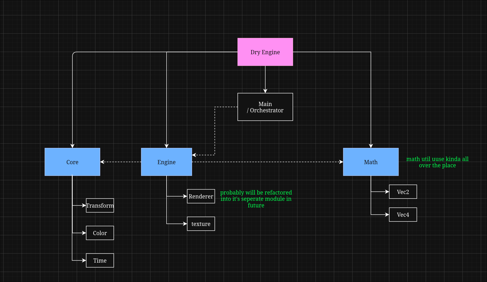

# DRY Engine

**DRY Engine** is a personal learning project focused on building a 2D game engine in C from the ground up.

The primary goal of this project is to deepen my understanding of systems programming, game engine architecture, graphics, networking, and software design by implementing the engine myself.

## Goals

- Build a 2D game engine entirely in C.
- Implement built-in networking support as a core engine feature.
- Learn through hands-on development rather than relying on existing engine frameworks.

## Project Philosophy

This project is a learning exercise. All code is written manually without the use of agentic coding assistants or LLM-generated source code. Documentation and reference material may be consulted, but the implementation is intentionally developed by hand to maximize learning and understanding

# Dry Engine Architecture

## Legend

- **Solid Arrow** → Ownership / Contains
- **Dashed Arrow** → Dependency / Uses

## Modules

### Core
Contains foundational engine systems:
- Time
- Transform
- Color
- Input *(planned)*

### Engine
Contains rendering and engine-facing systems:
- Renderer
- Texture

### Math
Provides mathematical primitives used throughout the engine:
- Vec2
- Vec4
